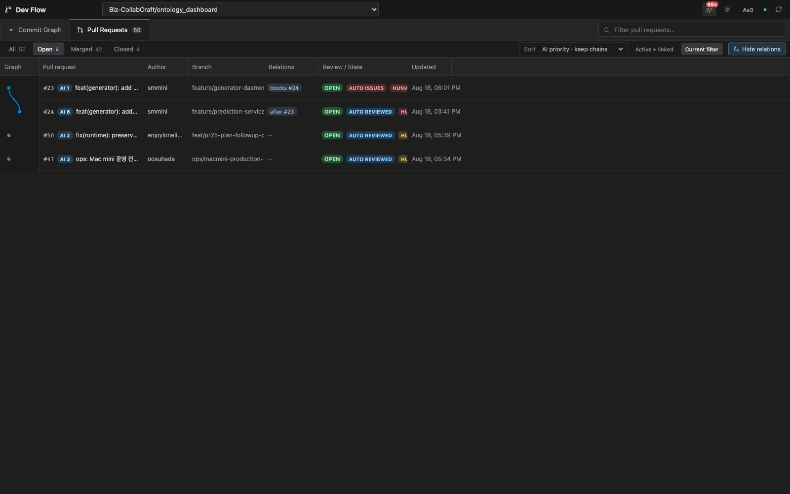
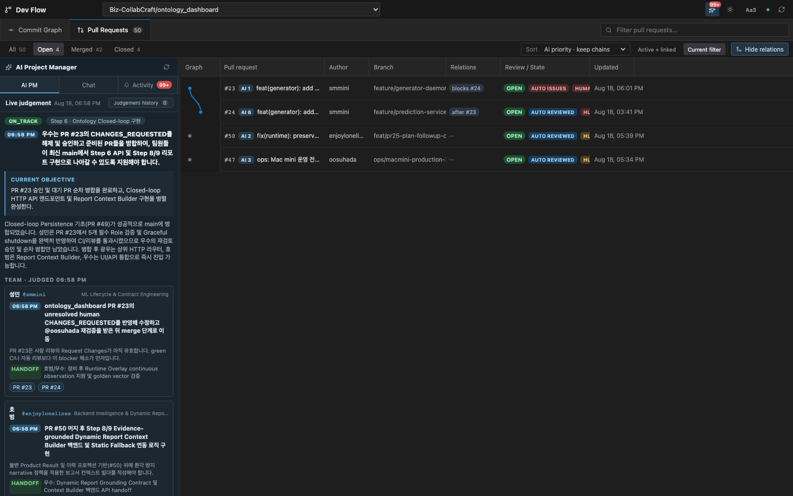
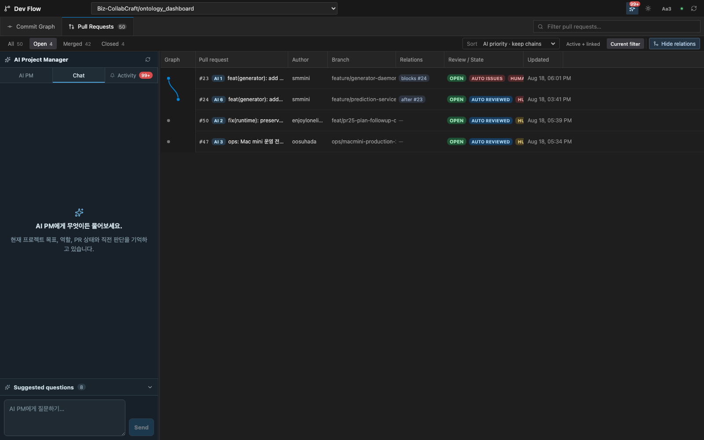
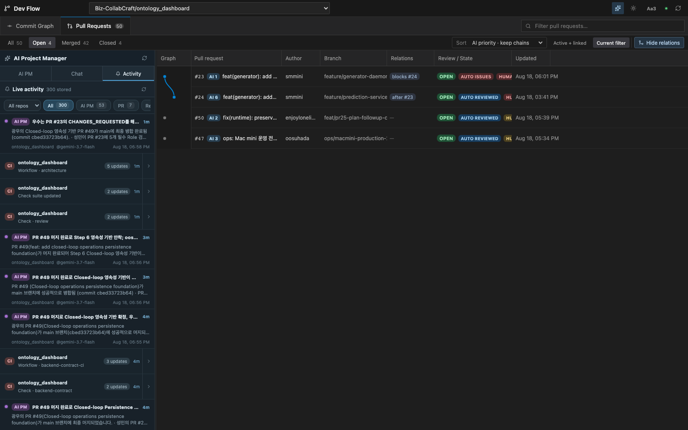
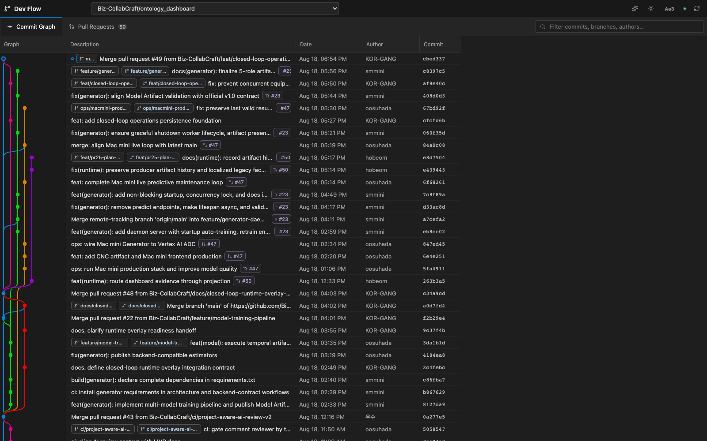

# Dev Flow Dashboard

GitHub PR/commit 흐름과 Gemini 기반 AI Project Manager를 한 화면에서 운영하기 위한 always-on developer console입니다.

**Live:** https://ontology.oosu.dev/dev_dashboard

## Why I Built It / 만든 이유

LLMs made coding faster, but that speed backfired — PRs piled up simultaneously, dependencies tangled, and merging one triggered a chain of rebases that consumed more time than the feature work itself. I built a dashboard that shows the team which PRs to review and merge first.

코드 작업에 LLM이 도입되면서 개발 속도는 빨라졌지만, 오히려 PR이 동시다발적으로 쌓이면서 병목이 생기기 시작했습니다. 하나를 머지하면 나머지를 연쇄적으로 rebase해야 하고, 기능 구현보다 PR 정리에 시간이 더 드는 상황이 반복됐습니다. 뭐부터 리뷰하고 머지해야 하는지 팀 전체가 한눈에 볼 수 있는 화면을 만들었습니다.

### What It Clarifies / 해결하는 질문

- 무엇부터 리뷰해야 하는가?
- 다음 행동의 owner는 누구인가?
- 어떤 PR이 downstream 작업을 막고 있는가?
- 어떤 작업은 계속 진행하고, 어떤 작업은 폐기해야 하는가?

Dev Flow Dashboard는 Git Graph 스타일의 deterministic 개발 흐름을 source of truth로 두고, 그 위에 Vertex AI 기반 AI Project Manager를 coordination layer로 결합합니다.

## Screenshots

### Pull Request Flow



### AI Project Manager



### AI PM Chat



### Activity Inbox



### Commit Graph



## Pull Request Flow

Pull Requests가 기본 진입 화면이며, 새 브라우저에서는 **Open + relations ON**으로 시작합니다.

- Open / Merged / Closed를 포함한 전체 PR lifecycle 조회
- branch 관계를 이용한 PR dependency/relations graph
- AI priority / Flow groups / recently updated 정렬
- Pull request / Author / Branch / Relations / Review·State / Updated의 6개 공유 컬럼
- List와 Relations Graph가 동일한 column width state와 resize handle 사용
- 컬럼 크기와 panel 크기 localStorage 유지
- human review / automated review / CI 상태를 별도 신호로 표시
- PR inspector에서 body, review, comment, commit, check 확인
- Markdown + collapsible review/comment cards

Relations Graph는 별도의 고정 폭 테이블을 만드는 대신 첫 번째 PR 컬럼 안에 graph lane을 overlay합니다. 따라서 List ↔ Graph 전환 중에도 동일한 여섯 컬럼의 정렬과 사용자가 조절한 폭이 유지됩니다.

### Manual PR Status Board

상단의 **PR Status Board**는 실시간 GitHub/Vertex/LLM 판단이 아니라 사람이 직접 확정해서 배포하는 운영 스냅샷입니다.

- source: `frontend/src/pr-status-board.json`
- `updatedAt` / `asOfLabel`로 기준 시각 명시
- PR별 `status`, `decision`, `summary`, `action`을 직접 수정
- merge 순서는 `mergePlan`에서 관리
- 파일 수정 후 일반 코드와 동일하게 commit/push/deploy하면 화면이 갱신됨

따라서 자동 PM 판단이 변해도 이 보드는 자동으로 바뀌지 않습니다. 팀에서 확인한 상태만 명시적으로 push해 공유할 때 사용합니다.

## Commit Graph

Commit Graph는 현재 브랜치·태그·commit topology와 commit metadata를 함께 보여줍니다.

- Git Graph 스타일 branch/lane rendering
- branch / tag / HEAD markers
- commit inspector와 changed-file tree
- diff / current file preview
- 관련 PR과 AI impact analysis
- commit columns resize + persistence

Density level이 올라갈 때 commit row height와 SVG graph 좌표도 함께 증가하므로 글자만 커지고 선/노드가 어긋나는 문제가 없습니다.

## AI Project Manager

AI PM은 프로젝트의 canonical docs와 현재 GitHub 상태를 함께 읽습니다.

- **Tiered Vertex AI**: routine PM refresh는 `gemini-3.5-flash-lite`, 사람 기술 리뷰/코멘트와 대화·commit reasoning은 `gemini-3.7-flash`
- canonical project docs에서 goal, role ownership, execution steps, out-of-scope, anti-overengineering rule을 추출한 Project Charter Memory
- 직전 PM context와 최근 webhook trigger를 다음 판단에 전달하는 rolling context
- 네 명의 팀원별 현재 `NOW` action
- PR priority queue, bottleneck, blocker, handoff, stop-doing signal
- 현재 execution step과 exit gate 판단
- PM judgement를 SQLite snapshot으로 저장하고 과거 시점 판단 복원

### Deterministic human review guard

LLM 응답과 무관하게 사람의 `CHANGES_REQUESTED`는 hard merge blocker로 처리합니다.

1. 해당 PR author가 요청사항을 반영하고 수정 commit을 push
2. 요청한 human reviewer에게 재검증 요청
3. reviewer의 최신 decisive state가 `APPROVED` 또는 `DISMISSED`가 되기 전에는 merge 권고 금지
4. green CI나 automated review는 이 guard를 해제하지 않음
5. 다만 superseded PR처럼 정답이 merge가 아니라 Close/폐기라면 바로 폐기 가능

이 규칙은 후속 unrelated webhook이 들어와도 현재 snapshot에 unresolved human request가 남아 있는 한 다시 적용됩니다.

## AI PM Chat

Chat은 별도의 blank assistant가 아니라 같은 Project Charter Memory와 현재 PM/GitHub context를 사용합니다. 예를 들어 다음 질문을 바로 할 수 있습니다.

- 지금 가장 큰 병목은 뭐야?
- 각 팀원이 지금 해야 할 일 알려줘
- 지금 머지해야 할 PR 순서 알려줘
- 오버엔지니어링 중인 작업이 있어?
- 다음 handoff는 누구에게 해야 해?

## Activity Inbox

GitHub webhook과 AI PM 판단을 SQLite Activity store에 기록하고 SSE로 열린 브라우저에 전달합니다.

- AI PM / PR / Review / Comment / Push / CI category filter
- repository filter
- 비슷한 이벤트 group / expand
- AI PM event 클릭 → 해당 historical PM judgement
- PR/review/comment 클릭 → PR inspector
- Push/CI 클릭 → commit inspector
- unread state localStorage 유지

## Live updates and fallback

브라우저는 GitHub API를 직접 호출하지 않습니다. FastAPI backend가 GitHub aggregator 역할을 하며 자격 증명은 서버에만 존재합니다.

- GitHub webhook payload → local snapshot patch; PR open/synchronize만 해당 PR 4개 endpoint targeted refresh
- webhook/AI/activity event → SSE live update
- SSE 연결 중 browser polling 없음; 연결이 끊긴 동안에만 5분 fallback polling
- webhook/SSE 갱신과 AI 재분석은 분리: bot/social noise는 deterministic UI만 갱신하고 Vertex를 호출하지 않음
- `check_run`/`check_suite`/`workflow_run`, PR synchronize, fallback 변화는 3~5분 quiet period로 coalesce
- startup/fallback에서 compact semantic snapshot hash가 이전 판단과 같으면 Vertex 호출 생략
- 자동 PM은 기본 KST 일일 30회 또는 input 1,250,000 tokens에서 soft-stop하며 수동 refresh/chat은 계속 사용 가능
- 10분 fallback watcher는 ETag/`If-None-Match` conditional request 사용
- 마지막 성공 GitHub snapshot을 `.state/snapshots/`에 저장
- GitHub rate limit 또는 일시 장애 시 stale snapshot으로 workbench 유지
- 403/429 rate limit 뒤에는 `Retry-After`/`X-RateLimit-Reset`까지 서버 전체 REST circuit을 차단
- AI PM judgement와 Activity는 SQLite에 보존

## Density, theme, and resizing

브라우저 zoom 대신 5단계 density/font control을 제공합니다. 상단의 `Aa1`~`Aa5` 버튼은 `1 → 2 → 3 → 4 → 5 → 1`로 순환하며 localStorage에 저장됩니다.

Density는 font-size만 바꾸지 않습니다. 단계가 올라갈수록 다음 요소가 함께 조금씩 커집니다.

- text / line-height
- PR·commit row height
- control / button / chip height
- padding / gap
- AI PM card spacing
- Activity row spacing
- Chat message/input spacing

반대로 PR/Commit column width, AI sidebar width, inspector width, page 전체 geometry는 zoom처럼 비례 확대하지 않습니다. 1280px 폭에서도 sidebar + inspector가 viewport 밖으로 밀리지 않도록 panel track에는 responsive upper bound가 적용됩니다.

Light/Dark theme, AI sidebar, right inspector, PR/commit columns는 각각 독립적으로 동작합니다.

## Architecture

```text
GitHub repositories
  ├─ REST API ───────────────┐
  └─ Webhooks ───────────────┤
                             v
                      FastAPI aggregator
                      ├─ deterministic graph/review state
                      ├─ stale snapshot fallback
                      ├─ SQLite activity + PM history
                      ├─ Project Charter Memory
                      └─ Vertex AI tier router
                           ├─ Gemini 3.5 Flash-Lite (routine)
                           └─ Gemini 3.7 Flash (reasoning/review)
                             │
                             ├─ SSE live events
                             └─ /api/*
                                  │
                                  v
                           React + Vite frontend
```

The deterministic Git/GitHub layer is authoritative for topology, lifecycle, reviews, checks, merge state, authorship, and dependency facts. Gemini is an advisory interpretation layer and does not mutate GitHub.

## Production deployment

현재 live instance는 개인 Mac mini 홈서버에서 실행됩니다.

- app bind: `127.0.0.1:4310`
- macOS launchd: `com.oosu.dev-flow-dashboard`
- public ingress: Cloudflare Tunnel
- public path: `https://ontology.oosu.dev/dev_dashboard`
- launch script는 macOS의 낮은 기본 file-descriptor limit 때문에 SSE/webhook 연결이 고갈되지 않도록 soft limit를 올린 뒤 Uvicorn을 실행

서비스는 loopback에만 bind되고 public ingress는 tunnel이 담당합니다.

### Automatic deploy from `main`

The Mac mini is registered as a repository-scoped GitHub Actions self-hosted
runner with the `dev-flow-dashboard` label. Every push to `main` runs
`.github/workflows/deploy-macmini.yml`: it validates/builds the frontend,
syncs tracked source into `~/services/dev-flow-dashboard` while preserving
`.env`, `.state`, and `.venv`, restarts `com.oosu.dev-flow-dashboard`, and
requires the local health endpoint to return `status: ok`.

The deploy logic lives in `scripts/deploy-macmini.sh` so the same deployment
can also be run manually on the Mac mini when needed.

### GitHub App authentication

개인 PAT quota와 대시보드 quota를 분리하려면 read-only GitHub App을 두 저장소에 설치하고 다음 값을 설정합니다. App 설정이 완전하면 `GITHUB_TOKEN`보다 installation token을 우선 사용하며 만료 전에 자동 갱신합니다.

```bash
GITHUB_APP_ID=123456
GITHUB_APP_INSTALLATION_ID=12345678
GITHUB_APP_PRIVATE_KEY_PATH=/run/secrets/dev-flow-dashboard.pem
```

필요한 repository permission은 Contents, Metadata, Pull requests, Checks의 read-only입니다. Activity에 issue/PR comments를 표시하려면 Issues도 read-only로 허용합니다. Webhook URL은 `/dev_dashboard/api/github/webhook`이며 기존 `GITHUB_WEBHOOK_SECRET` 검증을 그대로 사용합니다. 파일 mount가 어려운 환경은 PEM을 base64로 인코딩한 `GITHUB_APP_PRIVATE_KEY_BASE64`를 사용할 수 있습니다. 키와 installation token은 저장소에 커밋하지 않습니다.

전환 확인은 `/dev_dashboard/api/health`의 `githubAuthentication: "github-app"`과 `githubRestCircuit.paused: false`로 합니다.

## Local development

```bash
python3 -m venv .venv
.venv/bin/pip install -r backend/requirements-dev.txt

cd frontend
npm install
npm run build
cd ..

GITHUB_REPOSITORIES=owner/repo-a,owner/repo-b \
  .venv/bin/uvicorn backend.app.main:app --host 127.0.0.1 --port 4310
```

For frontend-only work:

```bash
cd frontend
npm run dev
```

## Tests

```bash
PYTHONPATH=. .venv/bin/pytest -q backend/tests

cd frontend
npm run lint
npm test
npm run build
```

Public browser validation is performed with Playwright using `domcontentloaded`; SSE is intentionally long-lived, so `networkidle` is not an appropriate readiness condition.

## Docker

```bash
cp .env.example .env
docker compose up -d --build
```

The containerized service also publishes only on `127.0.0.1:4310` by default so a reverse proxy or tunnel can own public ingress.

## Security

- GitHub/Vertex/webhook/tunnel credentials remain server-side.
- `.env`, `.state`, SQLite runtime DBs, generated credentials, and local virtual environments are not source artifacts.
- The browser only calls this service's API; it does not receive a GitHub token.
- Repository visibility should only be changed after checking both the current tracked tree and Git history for credentials.
- AI PM is read-only with respect to GitHub: it can recommend actions, not perform merges, closes, reviews, or comments.

## Attribution and license

The commit graph rendering code under `frontend/src/gitgraph/` preserves its MIT lineage and license notice in [`frontend/src/gitgraph/LICENSE`](frontend/src/gitgraph/LICENSE):

- **mhutchie Git Graph**
- **asispts/neo-git-graph** fork lineage

That MIT notice applies to the attributed Git Graph lineage described in that file. This repository currently does not add a separate top-level license grant for the rest of the project source.

## Architecture & Topics / 아키텍처 및 주제

**Architecture / 아키텍처**<br>
[`dependency-graph`](https://github.com/topics/dependency-graph) · [`event-driven-architecture`](https://github.com/topics/event-driven-architecture) · [`server-sent-events`](https://github.com/topics/server-sent-events) · [`circuit-breaker`](https://github.com/topics/circuit-breaker) · [`fallback-pattern`](https://github.com/topics/fallback-pattern) · [`stale-cache`](https://github.com/topics/stale-cache) · [`event-coalescing`](https://github.com/topics/event-coalescing) · [`snapshot-pattern`](https://github.com/topics/snapshot-pattern) · [`advisory-system`](https://github.com/topics/advisory-system) · [`read-only-integration`](https://github.com/topics/read-only-integration) · [`self-hosted-runner`](https://github.com/topics/self-hosted-runner) · [`reverse-proxy`](https://github.com/topics/reverse-proxy)

**Core technologies / 핵심 기술**<br>
[`github-app`](https://github.com/topics/github-app) · [`cloudflare-tunnel`](https://github.com/topics/cloudflare-tunnel)

**Project context / 프로젝트 맥락**<br>
[`code-review`](https://github.com/topics/code-review) · [`dashboard`](https://github.com/topics/dashboard) · [`developer-tools`](https://github.com/topics/developer-tools) · [`devops`](https://github.com/topics/devops) · [`github`](https://github.com/topics/github) · [`pull-request`](https://github.com/topics/pull-request) · [`real-time`](https://github.com/topics/real-time) · [`sse`](https://github.com/topics/sse) · [`team-workflow`](https://github.com/topics/team-workflow)

**Implementation stack / 구현 스택**<br>
[`docker`](https://github.com/topics/docker) · [`fastapi`](https://github.com/topics/fastapi) · [`github-api`](https://github.com/topics/github-api) · [`react`](https://github.com/topics/react) · [`typescript`](https://github.com/topics/typescript)
